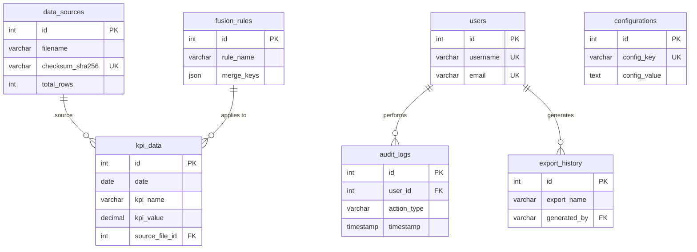

# Documentation Technique - Application Analyseur KPI
## Version 2.0

**Date :** 2024-01-14
**Projet :** Application d'Analyse KPI Portable
**Stack :** Electron 28.x + React 18.x + Python 3.11 + SQLite 3.x

---

## 📋 Table des Matières

1. [Architecture Globale](#1-architecture-globale)
2. [Base de Données SQLite](#2-base-de-données-sqlite)
3. [Backend Python](#3-backend-python)
4. [Frontend Electron/React](#4-frontend-electronreact)
5. [API et Interfaces IPC](#5-api-et-interfaces-ipc)
6. [Sécurité et Chiffrement](#6-sécurité-et-chiffrement)
7. [Configuration](#7-configuration)
8. [Workflows Techniques](#8-workflows-techniques)
9. [Tests et Qualité](#9-tests-et-qualité)
10. [Déploiement et Build](#10-déploiement-et-build)

---

## 1. Architecture Globale

### 1.1 Vue d'Ensemble

```
┌─────────────────────────────────────────────────────────────────┐
│                    COUCHE PRÉSENTATION                          │
│  ┌───────────────────────────────────────────────────────────┐  │
│  │  Electron Main Process (main.js)                          │  │
│  │  • Window management                                      │  │
│  │  • IPC handlers                                           │  │
│  │  • Python subprocess spawn                                │  │
│  └───────────────┬───────────────────────────────────────────┘  │
│                  │                                               │
│  ┌───────────────▼───────────────────────────────────────────┐  │
│  │  Electron Renderer Process (React App)                   │  │
│  │  • UI Components (React 18)                               │  │
│  │  • State Management (Zustand)                             │  │
│  │  • Charts (Recharts)                                      │  │
│  │  • Styling (TailwindCSS)                                  │  │
│  └───────────────┬───────────────────────────────────────────┘  │
└──────────────────┼───────────────────────────────────────────────┘
                   │ IPC (contextBridge)
                   │
┌──────────────────▼───────────────────────────────────────────────┐
│                    COUCHE MÉTIER                                 │
│  ┌───────────────────────────────────────────────────────────┐  │
│  │  Python Backend (Flask API locale)                       │  │
│  │                                                           │  │
│  │  ┌────────────────────────────────────────────────────┐  │  │
│  │  │  Modules ETL                                       │  │  │
│  │  │  • extractors.py  (CSV, Excel, JSON parsers)      │  │  │
│  │  │  • transformers.py (Cleaning, validation)         │  │  │
│  │  │  • loaders.py     (DB insertion)                  │  │  │
│  │  │  • merger.py      (Data fusion)                   │  │  │
│  │  └────────────────────────────────────────────────────┘  │  │
│  │                                                           │  │
│  │  ┌────────────────────────────────────────────────────┐  │  │
│  │  │  Modules Analytics                                 │  │  │
│  │  │  • stats.py       (Statistical calculations)      │  │  │
│  │  │  • aggregations.py (Data aggregation)             │  │  │
│  │  └────────────────────────────────────────────────────┘  │  │
│  │                                                           │  │
│  │  ┌────────────────────────────────────────────────────┐  │  │
│  │  │  Modules Export                                    │  │  │
│  │  │  • pdf_generator.py  (ReportLab)                  │  │  │
│  │  │  • excel_generator.py (openpyxl)                  │  │  │
│  │  └────────────────────────────────────────────────────┘  │  │
│  │                                                           │  │
│  │  ┌────────────────────────────────────────────────────┐  │  │
│  │  │  Modules Security                                  │  │  │
│  │  │  • encryption.py  (AES-256 encryption)            │  │  │
│  │  │  • audit.py       (Audit logging)                 │  │  │
│  │  └────────────────────────────────────────────────────┘  │  │
│  └───────────────┬───────────────────────────────────────────┘  │
└──────────────────┼───────────────────────────────────────────────┘
                   │ SQLAlchemy ORM
                   │
┌──────────────────▼───────────────────────────────────────────────┐
│                    COUCHE DONNÉES                                │
│  ┌───────────────────────────────────────────────────────────┐  │
│  │  SQLite Database (data/database.db)                      │  │
│  │                                                           │  │
│  │  Tables :                                                 │  │
│  │  • kpi_data         (Données KPI principales)           │  │
│  │  • data_sources     (Sources de fichiers)              │  │
│  │  • audit_logs       (Logs d'audit)                     │  │
│  │  • users            (Utilisateurs - optionnel)          │  │
│  │  • configurations   (Paramètres application)            │  │
│  │  • fusion_rules     (Règles de fusion)                  │  │
│  │  • export_history   (Historique exports)               │  │
│  └───────────────────────────────────────────────────────────┘  │
│                                                                  │
│  Fichiers :                                                      │
│  • data/imports/     (Fichiers source archivés)                 │
│  • data/exports/     (Rapports PDF/Excel générés)               │
│  • data/temp/        (Fichiers temporaires)                     │
│  • data/backups/     (Sauvegardes automatiques)                 │
└──────────────────────────────────────────────────────────────────┘
```

### 1.2 Technologies et Versions

| Composant | Technologie | Version | Rôle |
|-----------|-------------|---------|------|
| **Desktop Framework** | Electron | 28.x | Conteneur application desktop |
| **UI Framework** | React | 18.2+ | Interface utilisateur |
| **State Management** | Zustand | 4.x | Gestion d'état global |
| **Charts Library** | Recharts | 2.x | Visualisations graphiques |
| **Styling** | TailwindCSS | 3.x | Styles CSS |
| **Backend Runtime** | Python | 3.11 | Traitement données |
| **Data Processing** | Pandas | 2.1+ | Manipulation DataFrames |
| **Fast Data Processing** | Polars | 0.20+ | Alternative rapide (gros volumes) |
| **Database** | SQLite | 3.x | Base de données embarquée |
| **ORM** | SQLAlchemy | 2.0+ | Abstraction base de données |
| **PDF Generation** | ReportLab | 4.0+ | Génération rapports PDF |
| **Excel Processing** | openpyxl | 3.1+ | Lecture/écriture Excel |
| **Encryption** | cryptography | 41.x | Chiffrement AES-256 |
| **API Backend** | Flask | 3.0+ | API REST locale |

---

## 2. Base de Données SQLite

### 2.1 Schéma Complet

#### 2.1.1 Table: `kpi_data`

**Description :** Stocke toutes les données KPI importées et fusionnées

```sql
CREATE TABLE kpi_data (
    -- Clé primaire
    id INTEGER PRIMARY KEY AUTOINCREMENT,

    -- Données KPI
    date DATE NOT NULL,
    kpi_name VARCHAR(255) NOT NULL,
    kpi_value DECIMAL(15,2),
    kpi_unit VARCHAR(50),

    -- Catégorisation
    category VARCHAR(100),
    subcategory VARCHAR(100),
    region VARCHAR(100),
    department VARCHAR(100),

    -- Métadonnées source
    source_file_id INTEGER NOT NULL,
    original_row_number INTEGER,

    -- Qualité données
    data_quality_score DECIMAL(3,2),  -- 0.00 à 1.00
    is_anomaly BOOLEAN DEFAULT 0,
    anomaly_reason TEXT,

    -- Métadonnées JSON (flexible)
    metadata JSON,

    -- Audit
    created_at TIMESTAMP DEFAULT CURRENT_TIMESTAMP,
    updated_at TIMESTAMP DEFAULT CURRENT_TIMESTAMP,
    created_by VARCHAR(100),

    -- Contraintes
    FOREIGN KEY (source_file_id) REFERENCES data_sources(id) ON DELETE CASCADE,

    -- Index pour performance
    INDEX idx_kpi_date (date),
    INDEX idx_kpi_name (kpi_name),
    INDEX idx_kpi_category (category),
    INDEX idx_kpi_source (source_file_id),
    INDEX idx_kpi_composite (date, kpi_name, category)
);
```

**Exemple de données :**

```sql
INSERT INTO kpi_data (
    date, kpi_name, kpi_value, kpi_unit, category,
    source_file_id, data_quality_score, metadata
) VALUES (
    '2024-01-15',
    'Chiffre d''affaires',
    125000.50,
    '€',
    'Ventes',
    1,
    0.98,
    '{"sales_rep": "Jean Dupont", "region_code": "FR-IDF"}'
);
```

---

#### 2.1.2 Table: `data_sources`

**Description :** Catalogue des fichiers importés avec leurs métadonnées

```sql
CREATE TABLE data_sources (
    -- Clé primaire
    id INTEGER PRIMARY KEY AUTOINCREMENT,

    -- Informations fichier
    filename VARCHAR(255) NOT NULL,
    original_path TEXT,
    file_type VARCHAR(20) NOT NULL,  -- 'csv', 'excel', 'json'
    file_size_bytes INTEGER,

    -- Hash et intégrité
    checksum_sha256 VARCHAR(64) UNIQUE NOT NULL,

    -- Statistiques import
    total_rows INTEGER,
    imported_rows INTEGER,
    rejected_rows INTEGER,
    duplicate_rows INTEGER,

    -- Statut
    import_status VARCHAR(20) DEFAULT 'pending',  -- 'pending', 'processing', 'completed', 'failed'
    error_message TEXT,

    -- Métadonnées structure
    columns_detected TEXT,  -- JSON array des colonnes détectées
    encoding_detected VARCHAR(20),  -- 'UTF-8', 'ISO-8859-1', etc.
    delimiter_detected VARCHAR(10),  -- ',', ';', '\t', etc.

    -- Dates
    uploaded_at TIMESTAMP DEFAULT CURRENT_TIMESTAMP,
    processed_at TIMESTAMP,

    -- Utilisateur
    uploaded_by VARCHAR(100),

    -- Stockage physique
    archived_path TEXT,  -- Chemin vers fichier archivé

    -- Index
    INDEX idx_source_checksum (checksum_sha256),
    INDEX idx_source_status (import_status),
    INDEX idx_source_uploaded (uploaded_at)
);
```

**Exemple de données :**

```sql
INSERT INTO data_sources (
    filename, file_type, file_size_bytes, checksum_sha256,
    total_rows, imported_rows, import_status, columns_detected, encoding_detected
) VALUES (
    'ventes_janvier_2024.csv',
    'csv',
    524288,
    'a3d5f8b9c2e1d4a7b6c9e2f1a4d7b0c3e6f9a2d5b8c1e4f7a0d3b6c9e2f5a8b1',
    50000,
    49850,
    'completed',
    '["date", "montant", "region", "vendeur"]',
    'UTF-8'
);
```

---

#### 2.1.3 Table: `audit_logs`

**Description :** Journalisation complète de toutes les actions utilisateur

```sql
CREATE TABLE audit_logs (
    -- Clé primaire
    id INTEGER PRIMARY KEY AUTOINCREMENT,

    -- Identification
    user_id INTEGER,
    username VARCHAR(100),
    machine_id VARCHAR(100),  -- Identifiant unique de la machine

    -- Action
    action_type VARCHAR(50) NOT NULL,  -- 'IMPORT', 'EXPORT', 'VIEW', 'DELETE', 'MERGE', 'CONFIG_CHANGE'
    action_description TEXT,

    -- Cible de l'action
    target_type VARCHAR(50),  -- 'FILE', 'KPI', 'REPORT', 'CONFIG'
    target_id INTEGER,
    target_name VARCHAR(255),

    -- Résultat
    status VARCHAR(20) NOT NULL,  -- 'SUCCESS', 'FAILURE', 'PARTIAL'
    error_message TEXT,

    -- Détails (JSON flexible)
    details JSON,

    -- Contexte
    ip_address VARCHAR(45),  -- IPv4 ou IPv6
    session_id VARCHAR(100),

    -- Intégrité
    log_hash VARCHAR(64),  -- SHA256 du log pour vérifier intégrité

    -- Timestamp
    timestamp TIMESTAMP DEFAULT CURRENT_TIMESTAMP,

    -- RGPD
    is_sensitive BOOLEAN DEFAULT 0,  -- Marque les logs contenant données sensibles
    retention_until DATE,  -- Date d'expiration du log (90 jours par défaut)

    -- Index
    INDEX idx_audit_user (username),
    INDEX idx_audit_action (action_type),
    INDEX idx_audit_timestamp (timestamp),
    INDEX idx_audit_status (status),
    INDEX idx_audit_target (target_type, target_id)
);
```

**Exemple de données :**

```sql
INSERT INTO audit_logs (
    username, machine_id, action_type, action_description,
    target_type, target_name, status, details
) VALUES (
    'user@company.com',
    'DESKTOP-ABC123',
    'IMPORT',
    'Import fichier CSV avec 50000 lignes',
    'FILE',
    'ventes_janvier_2024.csv',
    'SUCCESS',
    '{"duration_ms": 4523, "rows_imported": 49850, "duplicates_removed": 150}'
);
```

---

#### 2.1.4 Table: `users`

**Description :** Gestion des utilisateurs (optionnel, pour mode multi-utilisateur)

```sql
CREATE TABLE users (
    -- Clé primaire
    id INTEGER PRIMARY KEY AUTOINCREMENT,

    -- Identification
    username VARCHAR(100) UNIQUE NOT NULL,
    email VARCHAR(255) UNIQUE,

    -- Authentification (si chiffrement activé)
    password_hash VARCHAR(255),  -- Argon2id hash
    salt VARCHAR(32),

    -- Profil
    full_name VARCHAR(255),
    role VARCHAR(50) DEFAULT 'user',  -- 'admin', 'user', 'viewer'

    -- Préférences
    preferences JSON,  -- {"theme": "dark", "default_chart": "line", ...}

    -- Sécurité
    is_active BOOLEAN DEFAULT 1,
    is_locked BOOLEAN DEFAULT 0,
    failed_login_attempts INTEGER DEFAULT 0,
    last_failed_login TIMESTAMP,

    -- Activité
    created_at TIMESTAMP DEFAULT CURRENT_TIMESTAMP,
    last_login TIMESTAMP,
    last_activity TIMESTAMP,

    -- RGPD
    gdpr_consent BOOLEAN DEFAULT 0,
    gdpr_consent_date TIMESTAMP,

    -- Index
    INDEX idx_user_username (username),
    INDEX idx_user_email (email),
    INDEX idx_user_active (is_active)
);
```

**Exemple de données :**

```sql
INSERT INTO users (
    username, email, full_name, role, preferences
) VALUES (
    'jdupont',
    'jean.dupont@company.com',
    'Jean Dupont',
    'user',
    '{"theme": "light", "language": "fr", "charts_per_page": 5}'
);
```

---

#### 2.1.5 Table: `configurations`

**Description :** Paramètres de configuration de l'application

```sql
CREATE TABLE configurations (
    -- Clé primaire
    id INTEGER PRIMARY KEY AUTOINCREMENT,

    -- Identification
    config_key VARCHAR(100) UNIQUE NOT NULL,
    config_value TEXT,
    config_type VARCHAR(20) DEFAULT 'string',  -- 'string', 'int', 'bool', 'json'

    -- Métadonnées
    description TEXT,
    category VARCHAR(50),  -- 'security', 'ui', 'performance', 'export'

    -- Validation
    is_encrypted BOOLEAN DEFAULT 0,  -- Si la valeur est chiffrée
    default_value TEXT,
    allowed_values TEXT,  -- JSON array des valeurs autorisées

    -- Audit
    created_at TIMESTAMP DEFAULT CURRENT_TIMESTAMP,
    updated_at TIMESTAMP DEFAULT CURRENT_TIMESTAMP,
    updated_by VARCHAR(100),

    -- Index
    INDEX idx_config_key (config_key),
    INDEX idx_config_category (category)
);
```

**Exemples de données :**

```sql
INSERT INTO configurations (config_key, config_value, config_type, category, description) VALUES
('encryption.enabled', 'false', 'bool', 'security', 'Activer le chiffrement AES-256 de la base de données'),
('encryption.algorithm', 'AES-256-GCM', 'string', 'security', 'Algorithme de chiffrement utilisé'),
('ui.theme', 'light', 'string', 'ui', 'Thème de l''interface (light/dark)'),
('export.default_format', 'pdf', 'string', 'export', 'Format d''export par défaut'),
('export.watermark.enabled', 'true', 'bool', 'export', 'Activer le watermark sur les exports PDF'),
('performance.max_rows_display', '10000', 'int', 'performance', 'Nombre max de lignes à afficher'),
('audit.retention_days', '90', 'int', 'security', 'Durée de rétention des logs d''audit (jours)');
```

---

#### 2.1.6 Table: `fusion_rules`

**Description :** Règles de fusion et de résolution de conflits

```sql
CREATE TABLE fusion_rules (
    -- Clé primaire
    id INTEGER PRIMARY KEY AUTOINCREMENT,

    -- Identification
    rule_name VARCHAR(100) NOT NULL,
    rule_description TEXT,

    -- Conditions
    source_file_pattern VARCHAR(255),  -- Regex ou glob pattern
    kpi_name_pattern VARCHAR(255),

    -- Clés de fusion
    merge_keys TEXT NOT NULL,  -- JSON array, ex: ["date", "region"]

    -- Stratégie de fusion
    merge_strategy VARCHAR(50) NOT NULL,  -- 'first', 'last', 'average', 'sum', 'max', 'min', 'manual'
    conflict_resolution VARCHAR(50),  -- 'priority', 'newest', 'highest_quality'

    -- Priorité des sources
    source_priority JSON,  -- {"ventes.csv": 1, "budget.xlsx": 2}

    -- Validation
    is_active BOOLEAN DEFAULT 1,

    -- Audit
    created_at TIMESTAMP DEFAULT CURRENT_TIMESTAMP,
    updated_at TIMESTAMP DEFAULT CURRENT_TIMESTAMP,
    created_by VARCHAR(100),

    -- Index
    INDEX idx_fusion_name (rule_name),
    INDEX idx_fusion_active (is_active)
);
```

**Exemple de données :**

```sql
INSERT INTO fusion_rules (
    rule_name, rule_description, merge_keys, merge_strategy, source_priority
) VALUES (
    'Fusion CA mensuel',
    'Fusion des fichiers de CA avec priorité au fichier budget',
    '["date", "region"]',
    'last',
    '{"budget.xlsx": 1, "ventes.csv": 2, "previsions.json": 3}'
);
```

---

#### 2.1.7 Table: `export_history`

**Description :** Historique des exports générés

```sql
CREATE TABLE export_history (
    -- Clé primaire
    id INTEGER PRIMARY KEY AUTOINCREMENT,

    -- Identification
    export_name VARCHAR(255) NOT NULL,
    export_type VARCHAR(20) NOT NULL,  -- 'pdf', 'excel', 'csv', 'json'

    -- Contenu
    title VARCHAR(255),
    description TEXT,
    kpi_filters JSON,  -- Filtres appliqués
    date_range_start DATE,
    date_range_end DATE,

    -- Fichier
    file_path TEXT NOT NULL,
    file_size_bytes INTEGER,
    checksum_sha256 VARCHAR(64),

    -- Sécurité
    is_encrypted BOOLEAN DEFAULT 0,
    has_watermark BOOLEAN DEFAULT 1,
    watermark_text VARCHAR(255),

    -- Statistiques
    pages_count INTEGER,
    charts_count INTEGER,
    data_rows_included INTEGER,

    -- Génération
    generated_at TIMESTAMP DEFAULT CURRENT_TIMESTAMP,
    generated_by VARCHAR(100),
    generation_duration_ms INTEGER,

    -- Partage
    shared_with TEXT,  -- JSON array d'emails
    access_count INTEGER DEFAULT 0,
    last_accessed TIMESTAMP,

    -- Index
    INDEX idx_export_type (export_type),
    INDEX idx_export_generated (generated_at),
    INDEX idx_export_user (generated_by)
);
```

**Exemple de données :**

```sql
INSERT INTO export_history (
    export_name, export_type, title, file_path, file_size_bytes,
    has_watermark, watermark_text, pages_count, charts_count
) VALUES (
    'Rapport_KPI_Q1_2024.pdf',
    'pdf',
    'Rapport KPI Q1 2024',
    'data/exports/Rapport_KPI_Q1_2024_20240114_143052.pdf',
    2457600,
    1,
    'CONFIDENTIEL - user@company.com - 2024-01-14',
    8,
    5
);
```

---

### 2.2 Relations Entre Tables



---

### 2.3 Requêtes SQL Fréquentes

#### 2.3.1 Récupérer tous les KPI pour une période

```sql
SELECT
    k.date,
    k.kpi_name,
    k.kpi_value,
    k.kpi_unit,
    k.category,
    ds.filename as source_file
FROM kpi_data k
INNER JOIN data_sources ds ON k.source_file_id = ds.id
WHERE k.date BETWEEN '2024-01-01' AND '2024-01-31'
  AND k.category = 'Ventes'
ORDER BY k.date, k.kpi_name;
```

#### 2.3.2 Statistiques d'import par source

```sql
SELECT
    filename,
    file_type,
    total_rows,
    imported_rows,
    rejected_rows,
    ROUND(100.0 * imported_rows / total_rows, 2) as success_rate_pct,
    import_status,
    processed_at
FROM data_sources
WHERE import_status = 'completed'
ORDER BY processed_at DESC
LIMIT 10;
```

#### 2.3.3 Logs d'audit des 7 derniers jours

```sql
SELECT
    username,
    action_type,
    action_description,
    target_name,
    status,
    timestamp
FROM audit_logs
WHERE timestamp >= datetime('now', '-7 days')
  AND status = 'SUCCESS'
ORDER BY timestamp DESC;
```

#### 2.3.4 KPI avec agrégation mensuelle

```sql
SELECT
    strftime('%Y-%m', date) as month,
    kpi_name,
    category,
    COUNT(*) as data_points,
    SUM(kpi_value) as total,
    AVG(kpi_value) as average,
    MIN(kpi_value) as minimum,
    MAX(kpi_value) as maximum
FROM kpi_data
WHERE date BETWEEN '2024-01-01' AND '2024-12-31'
GROUP BY month, kpi_name, category
ORDER BY month, kpi_name;
```

#### 2.3.5 Détection de doublons

```sql
SELECT
    date,
    kpi_name,
    category,
    COUNT(*) as duplicate_count,
    GROUP_CONCAT(source_file_id) as source_files
FROM kpi_data
GROUP BY date, kpi_name, category
HAVING COUNT(*) > 1
ORDER BY duplicate_count DESC;
```

#### 2.3.6 Exports récents avec statistiques

```sql
SELECT
    e.export_name,
    e.export_type,
    e.file_size_bytes / 1024.0 / 1024.0 as size_mb,
    e.pages_count,
    e.charts_count,
    e.generated_at,
    u.full_name as generated_by_name,
    e.access_count
FROM export_history e
LEFT JOIN users u ON e.generated_by = u.username
WHERE e.generated_at >= datetime('now', '-30 days')
ORDER BY e.generated_at DESC;
```

---

### 2.4 Triggers et Contraintes

#### 2.4.1 Trigger: Mise à jour automatique `updated_at`

```sql
CREATE TRIGGER update_kpi_data_timestamp
AFTER UPDATE ON kpi_data
FOR EACH ROW
BEGIN
    UPDATE kpi_data
    SET updated_at = CURRENT_TIMESTAMP
    WHERE id = NEW.id;
END;
```

#### 2.4.2 Trigger: Log d'audit automatique sur suppression

```sql
CREATE TRIGGER audit_kpi_delete
BEFORE DELETE ON kpi_data
FOR EACH ROW
BEGIN
    INSERT INTO audit_logs (
        action_type,
        action_description,
        target_type,
        target_id,
        status
    ) VALUES (
        'DELETE',
        'Suppression KPI: ' || OLD.kpi_name || ' du ' || OLD.date,
        'KPI',
        OLD.id,
        'SUCCESS'
    );
END;
```

#### 2.4.3 Trigger: Validation données KPI

```sql
CREATE TRIGGER validate_kpi_value
BEFORE INSERT ON kpi_data
FOR EACH ROW
WHEN NEW.kpi_value IS NOT NULL
BEGIN
    SELECT CASE
        WHEN NEW.kpi_value < -999999999 OR NEW.kpi_value > 999999999 THEN
            RAISE(ABORT, 'KPI value out of valid range')
    END;
END;
```

---

### 2.5 Vues (Views) Utiles

#### 2.5.1 Vue: KPI enrichis avec métadonnées source

```sql
CREATE VIEW v_kpi_enriched AS
SELECT
    k.id,
    k.date,
    k.kpi_name,
    k.kpi_value,
    k.kpi_unit,
    k.category,
    k.subcategory,
    k.region,
    k.data_quality_score,
    ds.filename as source_filename,
    ds.file_type as source_type,
    ds.uploaded_at as source_upload_date,
    k.created_at
FROM kpi_data k
INNER JOIN data_sources ds ON k.source_file_id = ds.id
WHERE ds.import_status = 'completed';
```

#### 2.5.2 Vue: Statistiques quotidiennes

```sql
CREATE VIEW v_daily_stats AS
SELECT
    date,
    COUNT(DISTINCT kpi_name) as kpi_count,
    COUNT(*) as total_records,
    COUNT(DISTINCT category) as category_count,
    AVG(data_quality_score) as avg_quality,
    SUM(CASE WHEN is_anomaly = 1 THEN 1 ELSE 0 END) as anomaly_count
FROM kpi_data
GROUP BY date
ORDER BY date DESC;
```

---

## 3. Backend Python

### 3.1 Structure du Projet Backend

```
backend/
├── main.py                  # Point d'entrée Flask
├── config.py                # Configuration
├── requirements.txt         # Dépendances Python
│
├── modules/
│   ├── __init__.py
│   │
│   ├── etl/
│   │   ├── __init__.py
│   │   ├── extractors.py       # Lecture fichiers
│   │   ├── transformers.py     # Nettoyage/validation
│   │   ├── loaders.py          # Chargement DB
│   │   └── merger.py           # Fusion données
│   │
│   ├── analytics/
│   │   ├── __init__.py
│   │   ├── stats.py            # Calculs statistiques
│   │   └── aggregations.py     # Agrégations
│   │
│   ├── export/
│   │   ├── __init__.py
│   │   ├── pdf_generator.py    # Génération PDF
│   │   └── excel_generator.py  # Génération Excel
│   │
│   ├── security/
│   │   ├── __init__.py
│   │   ├── encryption.py       # Chiffrement AES-256
│   │   └── audit.py            # Logs d'audit
│   │
│   └── database/
│       ├── __init__.py
│       ├── models.py           # SQLAlchemy models
│       ├── queries.py          # Requêtes réutilisables
│       └── migrations.py       # Migrations DB
│
├── utils/
│   ├── __init__.py
│   ├── logger.py               # Configuration logging
│   ├── validators.py           # Validation données
│   └── helpers.py              # Fonctions utilitaires
│
└── tests/
    ├── __init__.py
    ├── test_etl.py
    ├── test_analytics.py
    ├── test_security.py
    └── test_export.py
```

---

### 3.2 Models SQLAlchemy (models.py)

```python
from sqlalchemy import Column, Integer, String, DateTime, Boolean, Text, JSON, ForeignKey, DECIMAL, Date
from sqlalchemy.ext.declarative import declarative_base
from sqlalchemy.orm import relationship
from datetime import datetime

Base = declarative_base()

class KpiData(Base):
    """Table principale des données KPI"""
    __tablename__ = 'kpi_data'

    # Clé primaire
    id = Column(Integer, primary_key=True, autoincrement=True)

    # Données KPI
    date = Column(Date, nullable=False, index=True)
    kpi_name = Column(String(255), nullable=False, index=True)
    kpi_value = Column(DECIMAL(15, 2))
    kpi_unit = Column(String(50))

    # Catégorisation
    category = Column(String(100), index=True)
    subcategory = Column(String(100))
    region = Column(String(100))
    department = Column(String(100))

    # Métadonnées source
    source_file_id = Column(Integer, ForeignKey('data_sources.id', ondelete='CASCADE'), nullable=False)
    original_row_number = Column(Integer)

    # Qualité données
    data_quality_score = Column(DECIMAL(3, 2), default=1.0)
    is_anomaly = Column(Boolean, default=False)
    anomaly_reason = Column(Text)

    # Métadonnées JSON
    metadata = Column(JSON)

    # Audit
    created_at = Column(DateTime, default=datetime.utcnow)
    updated_at = Column(DateTime, default=datetime.utcnow, onupdate=datetime.utcnow)
    created_by = Column(String(100))

    # Relations
    source = relationship("DataSource", back_populates="kpi_records")

    def __repr__(self):
        return f"<KpiData(id={self.id}, name={self.kpi_name}, date={self.date}, value={self.kpi_value})>"


class DataSource(Base):
    """Table des sources de fichiers importés"""
    __tablename__ = 'data_sources'

    id = Column(Integer, primary_key=True, autoincrement=True)

    # Informations fichier
    filename = Column(String(255), nullable=False)
    original_path = Column(Text)
    file_type = Column(String(20), nullable=False)
    file_size_bytes = Column(Integer)

    # Hash et intégrité
    checksum_sha256 = Column(String(64), unique=True, nullable=False, index=True)

    # Statistiques import
    total_rows = Column(Integer)
    imported_rows = Column(Integer)
    rejected_rows = Column(Integer)
    duplicate_rows = Column(Integer)

    # Statut
    import_status = Column(String(20), default='pending', index=True)
    error_message = Column(Text)

    # Métadonnées structure
    columns_detected = Column(Text)  # JSON
    encoding_detected = Column(String(20))
    delimiter_detected = Column(String(10))

    # Dates
    uploaded_at = Column(DateTime, default=datetime.utcnow, index=True)
    processed_at = Column(DateTime)

    # Utilisateur
    uploaded_by = Column(String(100))

    # Stockage physique
    archived_path = Column(Text)

    # Relations
    kpi_records = relationship("KpiData", back_populates="source", cascade="all, delete-orphan")

    def __repr__(self):
        return f"<DataSource(id={self.id}, filename={self.filename}, status={self.import_status})>"


class AuditLog(Base):
    """Table des logs d'audit"""
    __tablename__ = 'audit_logs'

    id = Column(Integer, primary_key=True, autoincrement=True)

    # Identification
    user_id = Column(Integer)
    username = Column(String(100), index=True)
    machine_id = Column(String(100))

    # Action
    action_type = Column(String(50), nullable=False, index=True)
    action_description = Column(Text)

    # Cible
    target_type = Column(String(50), index=True)
    target_id = Column(Integer, index=True)
    target_name = Column(String(255))

    # Résultat
    status = Column(String(20), nullable=False, index=True)
    error_message = Column(Text)

    # Détails JSON
    details = Column(JSON)

    # Contexte
    ip_address = Column(String(45))
    session_id = Column(String(100))

    # Intégrité
    log_hash = Column(String(64))

    # Timestamp
    timestamp = Column(DateTime, default=datetime.utcnow, index=True)

    # RGPD
    is_sensitive = Column(Boolean, default=False)
    retention_until = Column(Date)

    def __repr__(self):
        return f"<AuditLog(id={self.id}, action={self.action_type}, user={self.username}, timestamp={self.timestamp})>"


class Configuration(Base):
    """Table de configuration"""
    __tablename__ = 'configurations'

    id = Column(Integer, primary_key=True, autoincrement=True)

    config_key = Column(String(100), unique=True, nullable=False, index=True)
    config_value = Column(Text)
    config_type = Column(String(20), default='string')

    description = Column(Text)
    category = Column(String(50), index=True)

    is_encrypted = Column(Boolean, default=False)
    default_value = Column(Text)
    allowed_values = Column(Text)

    created_at = Column(DateTime, default=datetime.utcnow)
    updated_at = Column(DateTime, default=datetime.utcnow, onupdate=datetime.utcnow)
    updated_by = Column(String(100))

    def __repr__(self):
        return f"<Configuration(key={self.config_key}, value={self.config_value})>"
```

---

### 3.3 API Flask (main.py)

```python
from flask import Flask, request, jsonify
from flask_cors import CORS
import os
from modules.database.models import Base
from sqlalchemy import create_engine
from sqlalchemy.orm import sessionmaker

# Configuration
app = Flask(__name__)
CORS(app)  # Permettre les requêtes depuis Electron

# Database
DB_PATH = os.path.join(os.getcwd(), 'data', 'database.db')
engine = create_engine(f'sqlite:///{DB_PATH}')
Base.metadata.create_all(engine)
Session = sessionmaker(bind=engine)

# Routes API
@app.route('/api/health', methods=['GET'])
def health_check():
    """Endpoint de santé"""
    return jsonify({
        'status': 'healthy',
        'version': '1.0.0',
        'database': 'connected'
    })

@app.route('/api/import/file', methods=['POST'])
def import_file():
    """Import un fichier CSV/Excel/JSON"""
    from modules.etl.extractors import FileExtractor
    from modules.etl.loaders import DataLoader

    file = request.files.get('file')
    if not file:
        return jsonify({'error': 'No file provided'}), 400

    try:
        # Extract
        extractor = FileExtractor()
        df = extractor.extract(file)

        # Load
        loader = DataLoader(Session())
        result = loader.load_dataframe(df, file.filename)

        return jsonify({
            'success': True,
            'message': f'Imported {result["imported_rows"]} rows',
            'data': result
        })

    except Exception as e:
        return jsonify({'error': str(e)}), 500

@app.route('/api/kpi/query', methods=['POST'])
def query_kpi():
    """Requête de données KPI avec filtres"""
    from modules.analytics.stats import KpiAnalyzer

    data = request.json
    filters = data.get('filters', {})

    try:
        analyzer = KpiAnalyzer(Session())
        results = analyzer.query_kpi(filters)

        return jsonify({
            'success': True,
            'data': results
        })

    except Exception as e:
        return jsonify({'error': str(e)}), 500

@app.route('/api/export/pdf', methods=['POST'])
def export_pdf():
    """Génère un rapport PDF"""
    from modules.export.pdf_generator import PdfGenerator

    data = request.json
    config = data.get('config', {})

    try:
        generator = PdfGenerator()
        pdf_path = generator.generate(config)

        return jsonify({
            'success': True,
            'file_path': pdf_path
        })

    except Exception as e:
        return jsonify({'error': str(e)}), 500

if __name__ == '__main__':
    app.run(host='127.0.0.1', port=5000, debug=False)
```

---

### 3.4 Module ETL - Extractors (extractors.py)

```python
import pandas as pd
import json
from typing import Union
import chardet

class FileExtractor:
    """Extraction de données depuis fichiers CSV/Excel/JSON"""

    def extract(self, file_path: str) -> pd.DataFrame:
        """
        Extrait les données d'un fichier

        Args:
            file_path: Chemin du fichier

        Returns:
            DataFrame pandas avec les données
        """
        file_extension = file_path.split('.')[-1].lower()

        if file_extension == 'csv':
            return self._extract_csv(file_path)
        elif file_extension in ['xlsx', 'xls']:
            return self._extract_excel(file_path)
        elif file_extension == 'json':
            return self._extract_json(file_path)
        else:
            raise ValueError(f"Format de fichier non supporté: {file_extension}")

    def _extract_csv(self, file_path: str) -> pd.DataFrame:
        """Extraction CSV avec détection automatique encoding et délimiteur"""
        # Détection encoding
        with open(file_path, 'rb') as f:
            raw_data = f.read(10000)  # Lire premiers 10KB
            result = chardet.detect(raw_data)
            encoding = result['encoding']

        # Détection délimiteur
        with open(file_path, 'r', encoding=encoding) as f:
            first_line = f.readline()
            delimiters = [',', ';', '\t', '|']
            delimiter_counts = {d: first_line.count(d) for d in delimiters}
            delimiter = max(delimiter_counts, key=delimiter_counts.get)

        # Lecture CSV
        df = pd.read_csv(
            file_path,
            encoding=encoding,
            delimiter=delimiter,
            parse_dates=True,
            infer_datetime_format=True
        )

        return df

    def _extract_excel(self, file_path: str) -> pd.DataFrame:
        """Extraction Excel (toutes les sheets fusionnées)"""
        excel_file = pd.ExcelFile(file_path)

        if len(excel_file.sheet_names) == 1:
            # Une seule sheet
            df = pd.read_excel(file_path, sheet_name=0)
        else:
            # Plusieurs sheets - fusion
            dfs = []
            for sheet_name in excel_file.sheet_names:
                sheet_df = pd.read_excel(file_path, sheet_name=sheet_name)
                sheet_df['_source_sheet'] = sheet_name
                dfs.append(sheet_df)
            df = pd.concat(dfs, ignore_index=True)

        return df

    def _extract_json(self, file_path: str) -> pd.DataFrame:
        """Extraction JSON avec normalisation"""
        with open(file_path, 'r', encoding='utf-8') as f:
            data = json.load(f)

        # Si liste d'objets
        if isinstance(data, list):
            df = pd.json_normalize(data)
        # Si objet unique
        elif isinstance(data, dict):
            df = pd.json_normalize([data])
        else:
            raise ValueError("Format JSON non supporté")

        return df
```

---

Voulez-vous que je continue avec les sections suivantes :
- 3.5 Module ETL - Transformers
- 3.6 Module ETL - Loaders
- 4. Frontend Electron/React
- 5. API et Interfaces IPC
- 6. Sécurité et Chiffrement
- 7. Configuration
- 8. Workflows Techniques
- 9. Tests et Qualité
- 10. Déploiement et Build

Ou préférez-vous que je me concentre sur des sections spécifiques ?